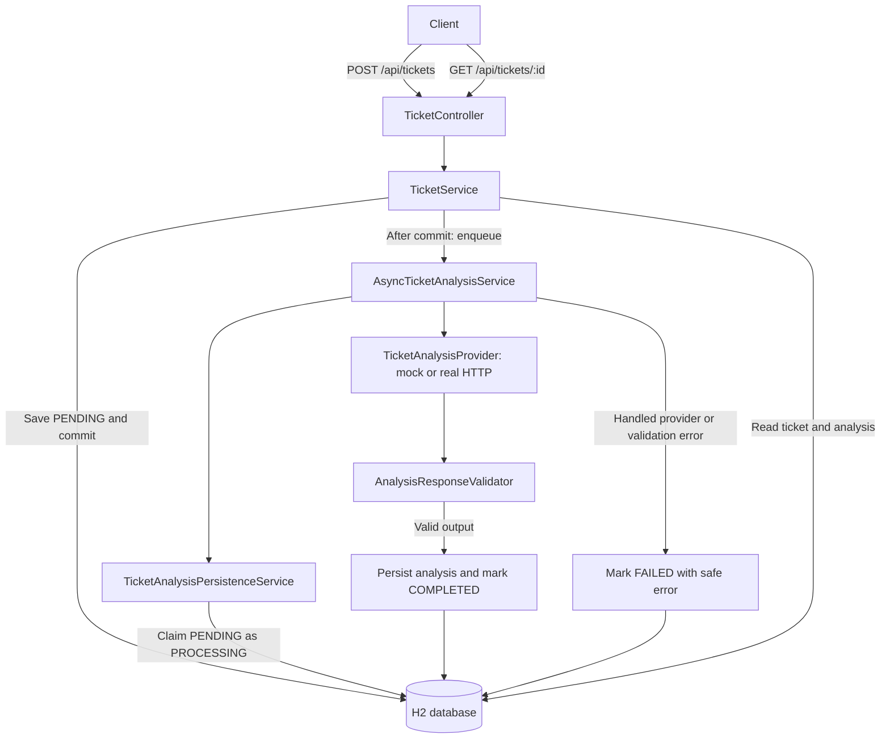

# AI-powered Support Ticket Assistant

A Spring Boot REST API that stores support tickets and asynchronously generates a category, summary, suggested response, recommended team, and confidence score. The default deterministic mock runs without an external account or API key; an optional HTTP adapter supports a Responses-style LLM API.

**Scope:** assessment/demo application, not a production-ready ticketing system. There is no UI, authentication, ticket listing, update/delete API, retry endpoint, or durable job queue. Data is lost when the application process stops.

## Architecture and lifecycle



Normal lifecycle: `PENDING → PROCESSING → COMPLETED` or `PENDING → PROCESSING → FAILED`.

- **After-commit dispatch:** prevents the worker reading an uncommitted ticket. POST returns the initial `PENDING` snapshot without waiting for model execution; a subsequent GET may already show a later state.
- **Atomic claim:** a conditional database update permits only a `PENDING` ticket to enter processing. Duplicate worker invocations are skipped; this is not end-to-end exactly-once delivery or POST idempotency.
- **Short transactions:** the provider call runs outside a database transaction. Saving valid analysis and marking the ticket complete occur together in a separate transaction.
- **Provider boundary:** domain services depend on `TicketAnalysisProvider`, not a vendor SDK. Spring selects the mock unless the `real-llm` profile is active.
- **Bounded executor:** 2 core threads, 4 maximum threads, and 100 queue slots, hard-coded in [AsyncConfig.java](src/main/java/com/example/ticketassistant/config/AsyncConfig.java). Queue rejection and unexpected failures are known gaps, not guaranteed `FAILED` transitions.

## Stack and layout

Java 17 compilation target; Spring Boot 3.5.11; Spring MVC; Bean Validation; Spring Data JPA; H2; JUnit 5, Mockito, and MockMvc. Dependencies and build configuration are in [pom.xml](pom.xml).

| Area | Entry points |
| --- | --- |
| REST boundary | [TicketController.java](src/main/java/com/example/ticketassistant/controller/TicketController.java), [CreateTicketRequest.java](src/main/java/com/example/ticketassistant/dto/CreateTicketRequest.java), [GlobalExceptionHandler.java](src/main/java/com/example/ticketassistant/exception/GlobalExceptionHandler.java) |
| Orchestration | [TicketService.java](src/main/java/com/example/ticketassistant/service/TicketService.java), [AsyncTicketAnalysisService.java](src/main/java/com/example/ticketassistant/service/AsyncTicketAnalysisService.java) |
| Persistence | [Ticket.java](src/main/java/com/example/ticketassistant/entity/Ticket.java), [TicketAnalysis.java](src/main/java/com/example/ticketassistant/entity/TicketAnalysis.java), [TicketAnalysisPersistenceService.java](src/main/java/com/example/ticketassistant/service/TicketAnalysisPersistenceService.java) |
| Providers | [MockTicketAnalysisProvider.java](src/main/java/com/example/ticketassistant/llm/MockTicketAnalysisProvider.java), [RealTicketAnalysisProvider.java](src/main/java/com/example/ticketassistant/llm/RealTicketAnalysisProvider.java) |
| Output contract | [AnalysisResponseValidator.java](src/main/java/com/example/ticketassistant/service/AnalysisResponseValidator.java), [ticket-analysis-prompt.md](src/main/resources/prompts/ticket-analysis-prompt.md) |

## Prerequisites, setup, and run

Run commands from the repository root. Install **JDK 17+** and **Maven** (3.9+ recommended); no Maven wrapper is included. Set `JAVA_HOME` to the JDK and add its `bin` directory to `PATH` if running `java` directly.

```shell
mvn clean verify
mvn spring-boot:run
```

The API starts at `http://localhost:8080/api/tickets`. Stop it with Ctrl+C. The root URL is not a web UI or health endpoint. No external database or API key is required in mock mode.

Alternatively, build and launch the executable JAR:

```shell
mvn clean package
java -jar target/ticket-assistant-0.0.1-SNAPSHOT.jar
```

## Configuration and providers

Defaults live in [application.yml](src/main/resources/application.yml); the real-provider profile is in [application-real-llm.yml](src/main/resources/application-real-llm.yml).

### Mock mode and failure demonstrations

| Property | Default | Meaning |
| --- | --- | --- |
| `llm.mock.mode` | `success` | Supported demo modes: `success`, `invalid`, `failure` |
| `llm.mock.delay-ms` | `100` | Simulated provider delay; not an enforced timeout |
| `llm.timeout-seconds` | `10` | Real HTTP connection and request timeout; does not cover mock execution or queue waiting |
| `server.port` | `8080` | HTTP port |
| `spring.h2.console.enabled` | `true` | Development database console |

The mock returns `IMPORT_FAILURE` when the subject contains “import” (case-insensitive), otherwise `GENERAL_SUPPORT`; it always recommends `SUPPORT` with confidence `0.85`. It does not perform semantic analysis.

Stop the current process and restart with one of these commands to demonstrate failure:

```shell
mvn spring-boot:run "-Dspring-boot.run.arguments=--llm.mock.mode=invalid"
mvn spring-boot:run "-Dspring-boot.run.arguments=--llm.mock.mode=failure"
```

Create a new ticket and poll GET. `invalid` emits incomplete/out-of-range analysis; `failure` throws a provider exception. Both should reach `FAILED` without saved analysis. Restarting clears existing tickets.

### Optional real HTTP provider

Supply configuration through environment variables or a local root `.env` file, then activate the profile:

```shell
mvn spring-boot:run "-Dspring-boot.run.profiles=real-llm"
```

The optional local file is loaded as **Java/Spring properties**, not shell syntax: use `KEY=value`, without `export` or surrounding quotes. It is excluded by [.gitignore](.gitignore). Never commit credentials or paste them into logs or issue reports.

| Environment variable | Default | Purpose |
| --- | --- | --- |
| `LLM_ENDPOINT` | Required | Complete Responses-compatible HTTP endpoint; no URL path is appended |
| `LLM_API_KEY` | Required | Provider credential |
| `LLM_MODEL` | `gpt-4.1-mini` via profile | Model or deployment identifier accepted by your endpoint |
| `LLM_AUTH_HEADER` | `api-key` | Authentication header name |
| `LLM_AUTH_PREFIX` | Empty | Prefix added to the credential; use `Bearer `, including its final space, for bearer authentication |
| `LLM_TIMEOUT_SECONDS` | `10` | Positive timeout in seconds for connection establishment and the HTTP request |

For bearer authentication, set `LLM_AUTH_HEADER=Authorization`; PowerShell preserves the required prefix space with `$env:LLM_AUTH_PREFIX = 'Bearer '`. Use HTTPS for remote endpoints. This profile sends customer ID, subject, description, priority, and product to the configured service; review data-sharing requirements and provider costs first.

**Compatibility is limited, not universal:** the JDK `HttpClient` adapter sends `{ "model": "...", "input": "..." }` and accepts direct analysis JSON, top-level `output_text`, or the first nested `output[].content[].text`. It does not implement Chat Completions `messages`/`choices`, streaming, retries, tool calls, or server-enforced JSON Schema. An arbitrary endpoint is not necessarily compatible. Live-provider compatibility was **not tested in this review**.

The profile default above is the effective normal value. The constructor has a different fallback (`gpt-5.4-1`); this should be aligned with the profile, but it does not override a configured value.

### H2 database

- JDBC URL: `jdbc:h2:mem:tickets;DB_CLOSE_DELAY=-1;DB_CLOSE_ON_EXIT=FALSE`.
- Console: `http://localhost:8080/h2-console`; use the JDBC URL above, username `sa`, and an empty password with unchanged default configuration.
- The database is process-local and in-memory. A separate application process cannot connect to the same in-memory data, and all data is lost on shutdown.
- Hibernate updates the schema automatically (`ddl-auto=update`); no versioned migration scripts are included.
- Disable the console using `SPRING_H2_CONSOLE_ENABLED=false` outside local development. Do not expose this unauthenticated demo to untrusted networks.

## API

### Create a ticket — POST /api/tickets

Request content type: `application/json`.

| Field | Required | Current behavior |
| --- | --- | --- |
| `customerId` | Yes | Nonblank string; trimmed before storage |
| `subject` | Yes | Nonblank string; trimmed before storage |
| `description` | Yes | Nonblank string; trimmed before storage |
| `priority` | Yes | Enum: `LOW`, `MEDIUM`, or `HIGH` |
| `product` | No | Trimmed; omitted, null, or blank becomes null |

**Length-validation gap:** database columns allow 255 characters for `customerId`, `subject`, and `product`, and 4,000 for `description`, but the request DTO does not enforce these limits. Oversized input can fail at persistence and return `500` instead of `400`. These are storage limits, not implemented request validation.

#### PowerShell example

In a second terminal:

```powershell
$body = @{
  customerId = 'CUST-101'
  subject = 'Unable to import a Word document'
  description = 'The import remains at 80% and eventually fails.'
  priority = 'HIGH'
  product = 'Import'
} | ConvertTo-Json

$ticket = Invoke-RestMethod -Method Post -Uri 'http://localhost:8080/api/tickets' -ContentType 'application/json' -Body $body
$ticket | ConvertTo-Json -Depth 5
Invoke-RestMethod -Uri "http://localhost:8080/api/tickets/$($ticket.ticketId)" | ConvertTo-Json -Depth 5
```

#### curl alternative (Bash)

```bash
curl -i -X POST http://localhost:8080/api/tickets \
  -H 'Content-Type: application/json' \
  -d '{"customerId":"CUST-101","subject":"Unable to import a Word document","description":"The import remains at 80% and eventually fails.","priority":"HIGH","product":"Import"}'
```

Returns `201 Created` with `Location: /api/tickets/{ticketId}` and the following response shape:

```json
{
  "ticketId": "a3c64c19-1ff0-4f65-bcca-9b5957315ad8",
  "customerId": "CUST-101",
  "subject": "Unable to import a Word document",
  "description": "The import remains at 80% and eventually fails.",
  "priority": "HIGH",
  "product": "Import",
  "status": "PENDING",
  "analysis": null,
  "processingError": null
}
```

Each POST creates a new UUID. Repeating the same request creates another ticket; there is no idempotency key.

### Retrieve a ticket — GET /api/tickets/{ticketId}

```bash
# Replace TICKET_ID with the ticketId from the POST response.
curl http://localhost:8080/api/tickets/TICKET_ID
```

Returns `200 OK` with the same ticket fields. While `PENDING` or `PROCESSING`, `analysis` is null. Repeat GET until `COMPLETED` or `FAILED`, using a bounded polling timeout and backoff rather than polling indefinitely. The default mock delay is 100 ms, but queueing means completion time is not guaranteed.

On completion, `status` is `COMPLETED`, `processingError` is null, and `analysis` contains:

```json
{
  "category": "IMPORT_FAILURE",
  "summary": "The customer needs assistance with Unable to import a Word document.",
  "suggestedResponse": "Thank you for reporting this. Our support team is reviewing the issue.",
  "recommendedTeam": "SUPPORT",
  "confidence": 0.85
}
```

For a handled analysis failure, GET still returns **200**, with `status: "FAILED"`, `analysis: null`, and `processingError: "Analysis could not be completed. Please try again later."` That message does not imply an implemented retry endpoint.

### Error responses

| HTTP status | Error code | Scenario |
| --- | --- | --- |
| `400` | `VALIDATION_ERROR` | Missing/blank required fields, null/invalid priority, or unreadable JSON |
| `404` | `TICKET_NOT_FOUND` | No ticket with the supplied ID; IDs are looked up as strings, not parsed as UUIDs |
| `500` | `INTERNAL_ERROR` | Unexpected errors, including persistence failures |

The centralized handler includes a timestamp and does not expose exception details:

```json
{
  "timestamp": "2026-09-13T12:00:00Z",
  "status": 400,
  "error": "VALIDATION_ERROR",
  "message": "Request fields are missing or invalid."
}
```

## Structured output and security boundaries

Model output is validated before persistence:

| Analysis field | Validation |
| --- | --- |
| `category`, `recommendedTeam` | Nonblank text, maximum 100 characters; trimmed value matches `[A-Z][A-Z0-9_]*` |
| `summary` | Nonblank text, maximum 2,000 characters |
| `suggestedResponse` | Nonblank text, maximum 4,000 characters |
| `confidence` | Finite JSON number between 0 and 1 inclusive |

The parsed object must have exactly these five fields. Non-object output, missing/null fields, unexpected fields, wrong types, and invalid values are rejected. Category/team identifiers are **not** checked against a business allow-list, and confidence is not calibrated or used as an acceptance threshold. Schema-valid content may still be inaccurate or unsafe; a human should review suggested responses before sending them to customers.

The [prompt template](src/main/resources/prompts/ticket-analysis-prompt.md) labels ticket text as untrusted and instructs the model not to follow embedded instructions. **This mitigates but does not prevent prompt injection.** The adapter sends a single combined input string; structural validation does not verify semantic correctness or confidentiality. No command-execution tools are attached to the model.

Application code does not intentionally log full tickets, raw provider output, or credentials, and handled failures use generic messages. Dependency logs and unexpected exceptions still require an operational logging/redaction policy; there is no comprehensive PII protection. There is also no authentication, per-customer authorization, rate limiting, or explicit application-level JSON body-size policy.

## Verification and test coverage

```shell
mvn test
mvn clean verify
```

**Verified in this review:** `mvn clean verify` passed with Maven 3.9.14 / JDK 21.0.11: **11 tests, 0 failures, 0 errors, 0 skipped**. Compilation targets Java 17; this is not a separate verification run on JDK 17 or against a live LLM.

| Test class | Tests | What it verifies |
| --- | --- | --- |
| [TicketControllerIntegrationTest.java](src/test/java/com/example/ticketassistant/controller/TicketControllerIntegrationTest.java) | 4 | Creation/persistence and initial status; invalid request; missing-ticket 404; eventual complete analysis through MockMvc, H2, and the async mock |
| [AsyncTicketAnalysisServiceTest.java](src/test/java/com/example/ticketassistant/service/AsyncTicketAnalysisServiceTest.java) | 7 | Successful analysis, invalid JSON, provider exception, explicit timeout, incomplete output, selected invalid field/value cases, and duplicate-worker skip |

The unit tests instantiate the persistence service with mocked repositories: they do not prove transaction rollback or concurrent database claims. The invalid-request integration test includes an invalid enum, so it does not independently demonstrate every Bean Validation constraint. Mock `invalid`/`failure` modes are manual REST demonstrations, not separate integration-test profiles.

### Production work deliberately out of scope

- Durable database, versioned migrations, backups, and retention policy.
- Transactional outbox or persistent queue, retries with backoff, dead-letter handling, restart recovery, and request idempotency.
- Authentication, customer-level authorization, rate limits, request-size limits, secret management, encryption, and PII redaction before provider calls.
- Structured redacted diagnostics, health/readiness endpoints, metrics, tracing, and provider latency/cost monitoring. Spring Boot Actuator is not included.
- Prompt versioning, business category/team allow-lists, semantic quality evaluation, and human approval of customer-facing suggestions.
- CI automation, real-adapter contract tests, and concurrency/load tests before horizontal scaling.

## Troubleshooting

| Symptom | Check |
| --- | --- |
| `java` or `mvn` is not recognized | JDK/Maven installation, `JAVA_HOME`, and `PATH`; compare `mvn -version` with the JDK used to launch the JAR |
| Port 8080 is occupied | Stop the other process or use `"-Dspring-boot.run.arguments=--server.port=8081"` with `mvn spring-boot:run` and update API URLs |
| `/` returns an error | Use the documented API; there is no homepage |
| Old ticket returns 404 after restart | Expected with the default in-memory database |
| Real profile fails to start | Required endpoint/key configuration, local properties-file syntax, and a positive timeout |
| Ticket reaches `FAILED` | Mock failure mode, control characters in mock subjects, provider connectivity/authentication/timeout, or invalid output; the API deliberately hides provider details |
| Ticket remains `PENDING`/`PROCESSING` | Queue rejection or unexpected worker/persistence failure; no automated recovery/retry endpoint exists |

## Assessment notes and interview walkthrough

Explain the after-commit boundary, atomic pending-ticket claim, provider abstraction, output validation, and separate completion transaction. Cover both the happy path and the remaining commit-to-enqueue reliability gap: asynchronous execution is not durable messaging.

Previously reported implementation effort: approximately 5–7 hours; this is a developer estimate, not measured by this review. An AI coding assistant was used for scaffolding, review, and testing. The submitter should independently verify the implementation, assessment requirements, and any development-time claims before submission.
